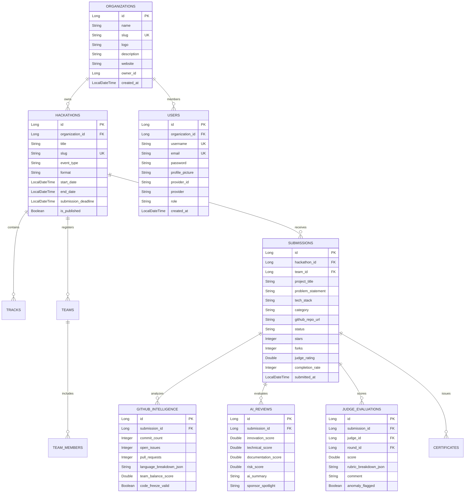

# 🗄️ Multi-Tenant Hackathon OS Database Schema

## 1. Multi-Tenant Entity Relationship Diagram (ERD)

---

## 2. Multi-Tenancy Strategy
- **Row-Level Tenant Isolation**: All core entities reference `organization_id` / `hackathon_id`.
- **Soft Delete Strategy**: Entities implement `is_deleted` (BOOLEAN) and `deleted_at` (TIMESTAMP).
- **Audit Columns**: `created_at`, `updated_at`, `created_by`, `updated_by` on all tables.
